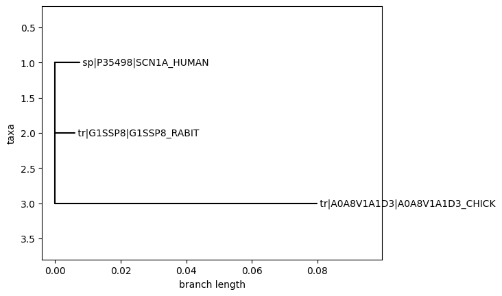

## 🧬 Epilepsy Ion Channel Comparative Genomics Pipeline

**WORK IN PROGRESS**

Explore how epilepsy-related ion channel genes have evolved across species using foundational comparative genomics tools.

> 🧪 *Built as part of my transition into computational biology, this pipeline integrates public gene/protein datasets with practical bioinformatics techniques to enable early-stage, cross-species analysis of epilepsy-associated genes.*

### 🚀 Pipeline Flow  
`Fetch orthologs → Align sequences → Build phylogenetic trees → Score conservation → Map human variants → (Optional) Visualize in 3D → Store & run on AWS`

## 🚦 Data Sources

- **UniProtKB**: For protein sequences and human variant annotations
- **NCBI Entrez**: For additional protein orthologs
- **EBI Clustal Omega**: For multiple sequence alignment and phylogenetic tree generation
- **RCSB PDB**: For 3D protein structure files (PDB)


📁 **Requirements:** [docs/requirements.md](docs/requirements.md)

### Running locally
```BASH
pip install -e .
comparative-genomics-pipeline
```
### Clear existing data
```BASH
rm -f /data/output/*/* # clear all data
```

## ✅ Pipeline Steps

- [x] Fetch orthologs
- [x] Align sequences
- [x] Build phylogenetic trees
- [x] Score conservation
- [x] Map human variants
- [x] Overlay variants on conservation plot
- [x] Fetch and save 3D protein structures (PDB)
- [ ] Visualize in 3D
- [ ] Store & run on AWS
- [ ] Clean and unit test all code
- [ ] Code analysis (linting, type checks, static analysis)
- [ ] Expand and polish documentation

## ✅ Research & Reporting

- [ ] Summarize research findings
- [ ] Plan further research
- [ ] Write conclusions and discussion

### Current Status

6/24/25 —  
Collected orthologous protein sequences for 5 key genes using NCBI and UniProt APIs; saved in `data/output/orthologs`.
Ran multiple sequence alignments (MSAs); results are in `data/output/msa`.  
Next up: figuring out how to actually interpret these alignments—reading up on best practices for MSA analysis before moving on to phylogenetic tree building, analysis WIP at `/data/results/msa/SCN1A_msa.md`

6/25/25 —  
Debugged the EBI Clustal Omega API integration for both MSA and tree generation. Did some hands-on analysis of the resulting trees and alignments, jotting down observations and questions in `/data/results/trees/trees_from_msa.md` and `/data/results/msa/SCN1A_msa.md`.

6/25/25 (later) —  
UniProt variant extraction is working now. All annotated human protein variants for SCN1A are being pulled (others possible too). Output is in `data/output/variants/P35498_variants.csv`. Next up: try to overlay these variants on alignments/conservation plots.

6/26/25 —  
Mapped human protein variants onto conservation scores for SCN1A and created a worksheet to help interpret the results (`/data/results/variants/conservation_variant_map.md`). Fetched and saved 3D protein structure for SCN1A (P35498) from RCSB PDB as a PDB file named with both accession and PDB ID.

## 📊 Sneak Peek: Example Outputs

Below are sample outputs **generated by this pipeline**:

> **Note:** All data and results shown here are still under active analysis: generating genomics data is far easier than interpreting it. 

| Conservation Plot Example | Phylogenetic Tree Example | Variant Overlay Example |
|:------------------------:|:------------------------:|:----------------------:|
|  |  |  |
