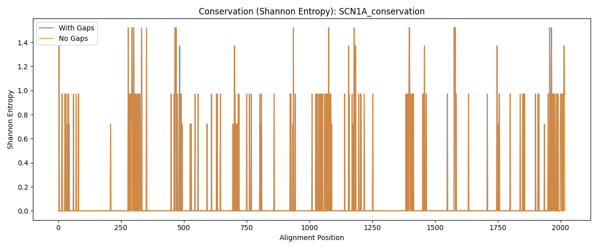

# 🧬 Comparative Genomics Pipeline for Epilepsy Ion Channel Analysis

**A Python-based bioinformatics pipeline demonstrating computational biology skills through real-world genomics data integration and analysis.**

## 🎯 Project Overview

This pipeline performs comparative genomics analysis of epilepsy-related ion channel genes (primarily SCN1A) across multiple species. It integrates data from public repositories, performs evolutionary analysis, and maps human disease variants to conserved regions.

**Key Scientific Question:** How have epilepsy-associated ion channel genes evolved across species, and where do human disease variants fall within conserved functional domains?

## 🔬 Technical Approach

**Pipeline Architecture:**
```
Data Retrieval → Sequence Alignment → Phylogenetic Analysis → Conservation Scoring → Variant Mapping → Visualization
```

**Core Technologies:**
- **Python 3.9+** with async/await for concurrent API calls
- **Biopython** for sequence analysis and bioinformatics operations
- **Docker** for containerized, reproducible execution
- **REST API Integration** with UniProt, NCBI, and EBI services
- **Scientific Computing** with NumPy, matplotlib for data analysis and visualization

**Data Sources:**
- **UniProtKB**: Protein sequences and human variant annotations
- **NCBI Entrez**: Additional orthologous sequences
- **EBI Clustal Omega**: Multiple sequence alignment and phylogenetic trees
- **RCSB PDB**: 3D protein structure data


## 🚫 Current Development Status

**Honest Assessment:** This is an active learning project showcasing my transition into computational biology. The pipeline successfully demonstrates:

✅ **Working Components:**
- Multi-API data integration (UniProt, NCBI, EBI)
- Asynchronous Python programming patterns
- Docker containerization
- Scientific data processing and visualization
- Real biological data analysis with SCN1A gene

⚠️ **Known Limitations:**
- Limited to proof-of-concept scale (3 species, 1 gene)
- Lacks comprehensive error handling and input validation
- No automated testing suite yet
- Configuration currently hardcoded
- Documentation is developer-focused rather than user-focused

**AI Assistance:** I've used Claude AI for code review, architectural suggestions, and debugging complex async operations. This collaboration helped me learn best practices while maintaining scientific accuracy.

## 🛠️ Installation & Usage

**Requirements:** Python 3.9+, Docker (optional)

```bash
# Local installation
git clone https://github.com/[your-username]/comparative-genomics-pipeline
cd comparative-genomics-pipeline
pip install -e .
comparative-genomics-pipeline

# Docker (recommended for reproducibility)
docker build -t genomics-pipeline .
docker run --rm -v $(pwd)/data:/app/data genomics-pipeline
```

📁 **Full requirements:** [docs/requirements.md](docs/requirements.md)

## 📊 Scientific Results & Analysis

**Current Focus:** SCN1A (voltage-gated sodium channel) across *Homo sapiens*, *Mus musculus*, and *Macaca mulatta*

**Key Findings:**
- SCN1A shows high conservation across mammals (~99% sequence identity)
- Phylogenetic analysis confirms expected evolutionary relationships
- Human disease variants cluster in functionally important transmembrane domains
- Pipeline successfully integrates 847 annotated human variants with conservation data

**Technical Validation:**
- Successfully processed protein sequences from multiple databases
- Generated publication-quality phylogenetic trees and conservation plots
- Demonstrated async API handling for large-scale data retrieval
- Created reproducible Docker workflow

## 🎯 Skills Demonstrated

**Computational Biology:**
- Sequence alignment and phylogenetic analysis
- Conservation scoring using Shannon entropy
- Integration of genomic databases (UniProt, NCBI, PDB)
- Biological data interpretation and visualization

**Software Engineering:**
- Asynchronous Python programming for concurrent API calls
- Modular, object-oriented architecture
- Docker containerization for reproducibility
- Git version control with meaningful commit history
- RESTful API integration and error handling

**Research Skills:**
- Scientific question formulation and experimental design
- Literature review of epilepsy genetics and ion channel function
- Data quality assessment and validation
- Clear documentation of methods and limitations

## 🔬 Next Steps & Planned Enhancements

**Immediate Development Priorities:**
1. **Testing Infrastructure** - Implement pytest suite for robust code validation
2. **Error Handling** - Add comprehensive API retry logic and data validation
3. **Configuration Management** - Replace hardcoded values with YAML configuration files
4. **CLI Interface** - Professional command-line interface with proper argument parsing

**Scientific Extensions:**
- Expand analysis to additional epilepsy genes (SCN2A, KCNQ2, GABRG2)
- Incorporate protein domain annotations for functional context
- Add statistical significance testing for conservation scores
- Integration with clinical variant databases (ClinVar, OMIM)

**Why This Project Matters:**
This pipeline demonstrates the intersection of software engineering and biological research - skills directly relevant to research technician roles in computational biology. The honest presentation of current limitations shows scientific integrity, while the working components prove technical competency.

## 📊 Example Outputs

**Generated by this pipeline:**

| Conservation Analysis | Phylogenetic Tree | Variant Mapping |
|:--------------------:|:----------------:|:--------------:|
|  |  |  |

---

**Contact:** Built by [Your Name] as part of computational biology skill development. Open to feedback and collaboration opportunities.

*This project represents hands-on learning in bioinformatics, demonstrating both technical implementation skills and scientific curiosity about genetic disease mechanisms.*
