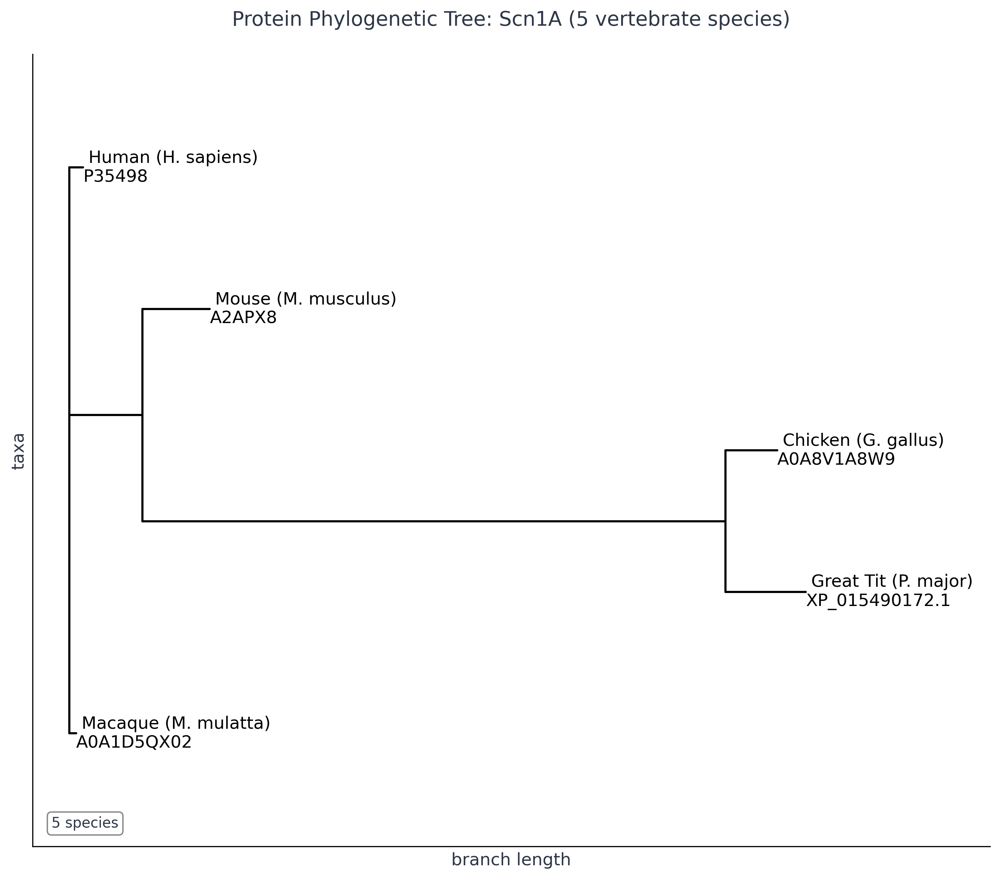
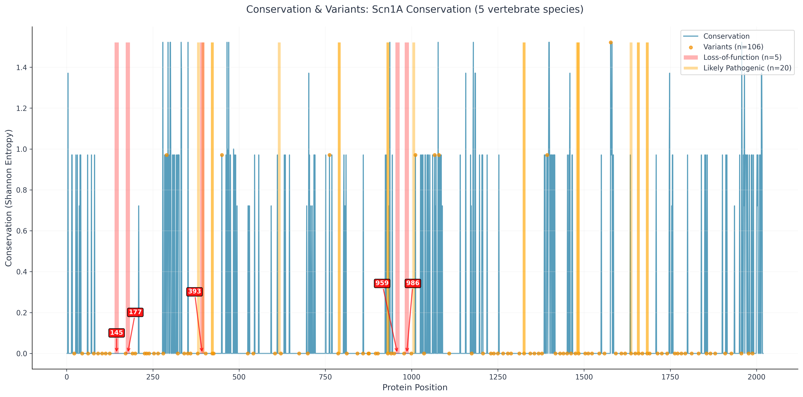

# Comparative Genomics Pipeline

A Python pipeline for analyzing evolutionary conservation of epilepsy-associated genes across vertebrate species, focusing on SCN1A (Dravet syndrome) and DEPDC5 (focal epilepsy).

**Current Status:** Work in progress. Core functionality implemented, testing and validation ongoing.

**Pipeline:** Ortholog retrieval → Multiple sequence alignment → Phylogenetic analysis → Conservation scoring → Human variant mapping

**Primary Genes:** SCN1A (voltage-gated sodium channel, Dravet syndrome) and DEPDC5 (mTOR pathway regulator, focal epilepsy)
**Species:** Human, mouse, macaque, chicken, great tit

## Implementation

**Data Sources:**
- UniProtKB: Protein sequences, variant annotations
- NCBI Entrez: Orthologous sequences
- EBI Clustal Omega: MSA and phylogenetic trees
- RCSB PDB: Protein structures

**Technologies:**
- Python 3.9+ with asyncio for concurrent API calls
- Biopython for sequence analysis
- Docker for containerization
- NumPy/matplotlib for data processing and visualization


## Current Functionality

**Working:**
- Multi-database API integration (UniProt, NCBI, EBI)
- Asynchronous data retrieval and processing
- Multiple sequence alignment via Clustal Omega
- Phylogenetic tree construction
- Shannon entropy conservation scoring
- Human variant mapping (SCN1A)
- Docker containerization

**Limitations:**
- Proof-of-concept scale (5 species, 2 genes)
- Limited error handling and input validation
- Hardcoded configuration
- No automated testing suite
- Minimal documentation

## 🛠️ Installation & Usage

**Requirements:** Python 3.10+, Docker (recommended for reproducibility), and git.

### 1. Clone the repository
```bash
git clone https://github.com/wperlichek/comparative-genomics-pipeline.git
cd comparative-genomics-pipeline
```

### 2. Install Python dependencies (local development)
```bash
pip install -e .
```

### 3. Run the pipeline (local)
```bash
comparative-genomics-pipeline
```

### 4. Build and run with Docker (recommended)
```bash
docker build -t genomics-pipeline .
docker run --rm -v $(pwd)/data:/app/data genomics-pipeline
```
- The `-v $(pwd)/data:/app/data` flag mounts your local `data/` directory for input/output.

### 5. Clear previous results
```bash
rm -rf ./data/output/*
```

### 6. Run tests
```bash
pytest
```

---

- Input configuration: Edit `data/input/genes_to_proteins.json` to specify which genes and species to analyze.
- Results (plots, trees, CSVs) are saved in `data/output/` subfolders.
- For troubleshooting Docker, see the README and `docs/requirements_notes.md` for platform-specific tips.
- For cloud/AWS usage, see the DevOps section in the documentation.

## Development Roadmap

**Immediate Priorities:**
- Comprehensive testing suite (pytest)
- Robust error handling and API retry logic
- Configuration management (YAML-based)
- Command-line interface with proper argument parsing

**Planned Extensions:**
- Enhanced analysis of SCN1A and DEPDC5 variants
- Protein domain annotation integration
- Statistical significance testing for conservation scores
- Clinical variant database integration (ClinVar, OMIM)

## Current Analysis Outputs

### SCN1A



**Protein Phylogenetic Tree:** Evolutionary relationships confirming expected species divergence patterns.


**Conservation Analysis:** SCN1A evolutionary conservation across 5 vertebrate species, with SCN1A showing 90.2% of positions highly conserved.



**Variant Mapping:** Human SCN1A variants with loss-of-function variants highlighted.

### DEPDC5


**Protein Phylogenetic Tree:** Evolutionary relationships confirming expected species divergence patterns.


**Conservation Analysis:** DEPDC5 evolutionary conservation across 5 vertebrate species.


**Variant Mapping:** Human DEPDC5 variants with likely pathogenic variants highlighted.

## Research Focus

**SCN1A (Dravet Syndrome):** Voltage-gated sodium channel predominantly expressed in GABAergic interneurons. Loss-of-function variants impair interneuron firing, reducing GABA release and causing network disinhibition leading to hyperexcitability and seizures.

**DEPDC5 (Focal Epilepsy):** DEP domain-containing protein 5, part of the GATOR1 complex that regulates mTOR signaling. Mutations cause focal cortical dysplasia and familial focal epilepsy with variable foci, affecting neural development and excitability through mTOR pathway dysregulation.

*For detailed research motivations and hypotheses, see [docs/early_hypothesis_research.md](docs/early_hypothesis_research.md).*

## Daily Log

### 2025-06-28
Confirmed that loss of function variants occurred in highly conserved regions, which was expected and validates the accuracy of the data pipeline.

**Question:** After asking what "loss of function" means and learning that SCN1A LoF variants reduce sodium current, I expected this would cause hypoexcitability, but Dravet syndrome causes hyperexcitability and seizures. Why does REDUCING sodium current promote hyperexcitability?

**Answer:** SCN1A is preferentially expressed in GABAergic interneurons. LoF variants impair interneuron firing, reducing GABA release and disinhibiting the network. Excitatory neurons use multiple sodium channel subtypes and are less SCN1A-dependent.

**Reference:** [Science Translational Medicine - Interneuron-specific dual-AAV SCN1A gene replacement corrects epileptic phenotypes in mouse models of Dravet syndrome](https://www.science.org/doi/10.1126/scitranslmed.adn5603)

Updated conservation-variant plot to separate LoF variants (red) from all variants (orange) in the bottom histogram for better visualization of where critical variants cluster in the conservation distribution.

**Question:** Are variants more likely to occur in regions that are highly conserved because of nature or because we more strictly analyze variants in sequences that are highly conserved and it's a part of their definition?

**Answer:** This is primarily a methodological artifact rather than biological reality. The apparent enrichment of variants in conserved regions occurs because: (1) We preferentially analyze protein-coding and functionally important regions that are inherently more conserved, (2) These regions receive more clinical scrutiny leading to better variant detection, and (3) Biologically, variants in truly conserved regions are actually less frequent due to purifying selection, but when present are more likely to be pathogenic and thus reported. The SCN1A analysis validates this - LoF variants cluster in conserved functional domains where they have measurable phenotypic impact.

### 2025-06-29
**Plot Simplifications:** Removed density distribution panel from conservation plots for cleaner scientific presentation. Single-panel design maintains all essential conservation statistics in legend while improving readability.

**Research Focus Update:** Pipeline now configured for dual-gene analysis focusing exclusively on SCN1A (Dravet syndrome, voltage-gated sodium channel) and DEPDC5 (focal epilepsy, mTOR pathway regulator). Removed references to other epilepsy genes to concentrate analysis on these two distinct but complementary mechanisms: SCN1A affecting interneuron excitability through sodium channel dysfunction, and DEPDC5 affecting cortical development through mTOR pathway dysregulation.

**DEPDC5 data added:**
Early data from DEPDC5 looks promising but raises questions on how best to display comparisons with SCN1A, since no LoF variants have been identified in DEPDC5 and the focus will be on likely pathogenic variants instead. The plan is to map loss-of-function, likely pathogenic, and pathogenic variants in both SCN1A and DEPDC5 to capture key candidates. Raw variant data for both genes will be re-verified and vetted to ensure accuracy.

---

*Self-directed computational biology project. Ongoing development and validation.*
