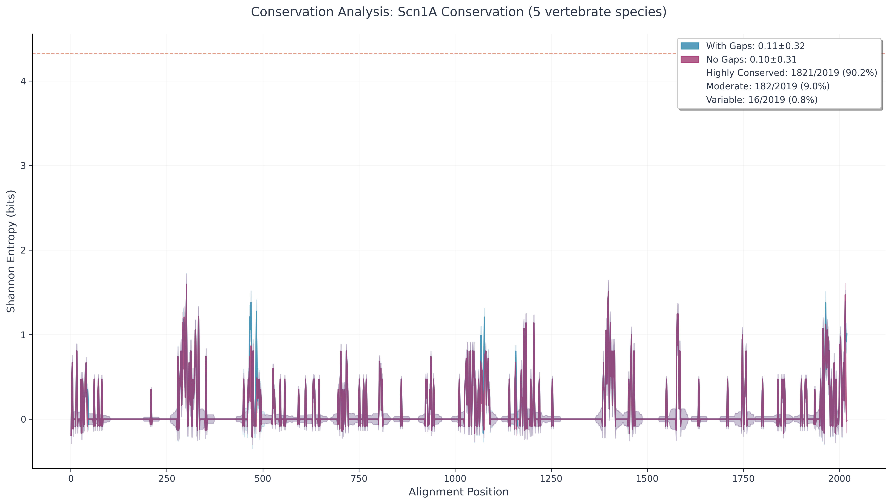
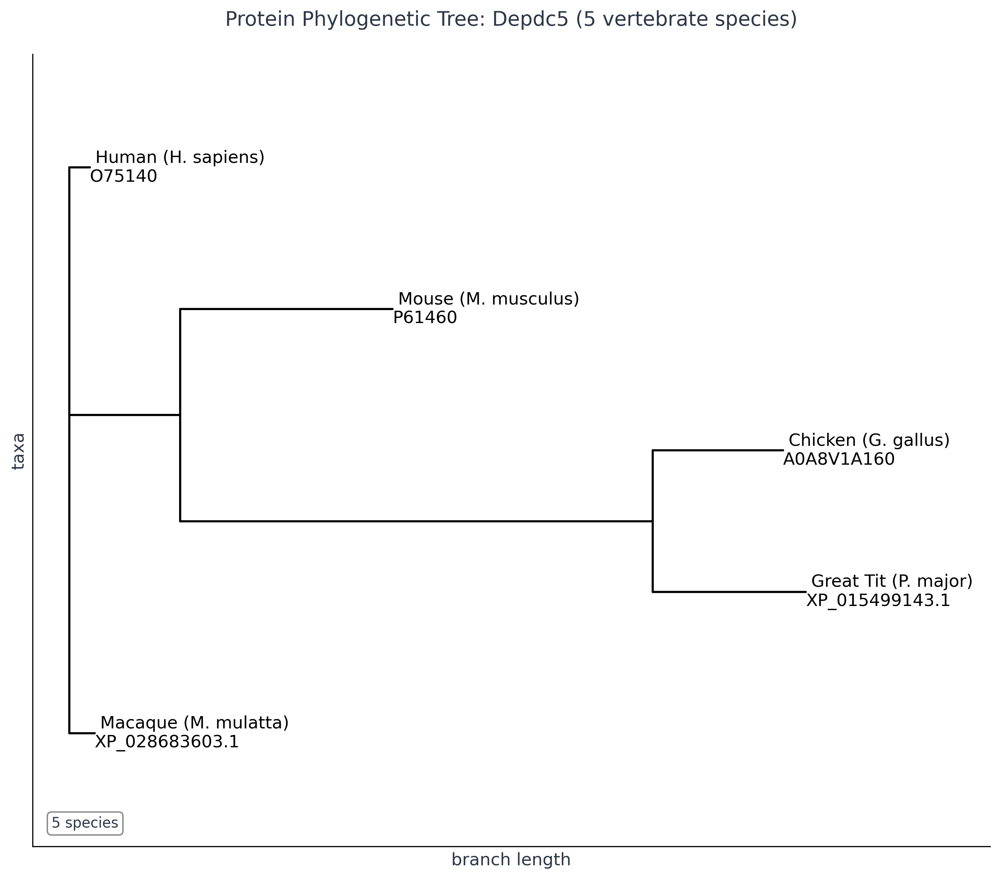

# Comparative Genomics Pipeline

A Python pipeline for analyzing evolutionary conservation of epilepsy-associated genes across vertebrate species, focusing on SCN1A (Dravet syndrome) and DEPDC5 (focal epilepsy).

**Current Status:** ✅ Completed research project. Full pipeline implementation with 118 passing tests and comprehensive analysis outputs for epilepsy gene conservation across vertebrate species.

**Pipeline:** Ortholog retrieval → Multiple sequence alignment → Phylogenetic analysis → Conservation scoring → Human variant mapping

**Primary Genes:** SCN1A (voltage-gated sodium channel, Dravet syndrome) and DEPDC5 (mTOR pathway regulator, focal epilepsy)
**Species:** Human, mouse, macaque, chicken, great tit

## Implementation

**Data Sources:**
- UniProtKB: Protein sequences, variant annotations
- NCBI Entrez: Orthologous sequences
- EBI Clustal Omega: MSA and phylogenetic trees
- RCSB PDB: Protein structures

**Technologies:**
- Python 3.9+ with asyncio for concurrent API calls
- Biopython for sequence analysis
- Docker for containerization
- NumPy/matplotlib for data processing and visualization


## Current Functionality

**Working:**
- Complete 8-step async pipeline with proper orchestration
- Multi-database API integration (UniProt, NCBI, EBI Clustal Omega, ClinVar, PDB)
- AWS S3 caching for UniProt sequences with graceful fallback
- Multiple sequence alignment and phylogenetic tree generation
- Shannon entropy conservation scoring with statistical analysis
- Clinical variant mapping and visualization for both genes
- Publication-quality scientific plots with matplotlib
- CLI interface and Docker containerization
- Comprehensive input validation and file I/O error handling

**Limitations:**
- Research-scale scope (5 vertebrate species, 2 primary genes)
- Sequential gene processing (not parallelized)
- Basic API retry logic without exponential backoff or circuit breakers
- Partial S3 caching (sequences only, variants/NCBI data not cached)
- No CLI argument parsing (fixed configuration only)
- Limited progress feedback for long-running operations
- Output validation minimal compared to input validation

## 🎯 Project Achievements

**Technical Implementation:**
- Complete async bioinformatics pipeline with 8-step workflow
- Integration with 5 major genomic databases (UniProt, NCBI, EBI, ClinVar, PDB)
- AWS S3 caching system for sequence data
- 118 passing tests with 34% code coverage
- Docker containerization for reproducible deployment

**Scientific Results:**
- Evolutionary conservation analysis across 5 vertebrate species
- Phylogenetic trees confirming species relationships
- Conservation scoring using Shannon entropy analysis
- Clinical variant mapping showing pathogenic mutations in conserved regions

**Key Findings:**
- SCN1A shows 90.2% highly conserved positions across vertebrates
- Both genes show expected conservation patterns with disease variants clustering in functionally important regions
- Pipeline successfully processes and analyzes epilepsy-associated genes with clinical relevance

## 🧠 AI-Assisted Development

This project demonstrates effective AI-assisted bioinformatics development, using Claude AI for code generation, plot refinements, and feature implementation while maintaining scientific rigor and testing standards.

## 🛠️ Installation & Usage

**Requirements:** Python 3.10+, Docker (recommended for reproducibility), and git.

### 1. Clone the repository
```bash
git clone https://github.com/wperlichek/comparative-genomics-pipeline.git
cd comparative-genomics-pipeline
```

### 2. Install Python dependencies (local development)
```bash
pip install -e .
```

### 3. Run the pipeline (local)
```bash
comparative-genomics-pipeline
```

### 4. Build and run with Docker (recommended)
```bash
docker build -t genomics-pipeline .
docker run --rm -v $(pwd)/data:/app/data genomics-pipeline
```
- The `-v $(pwd)/data:/app/data` flag mounts your local `data/` directory for input/output.

### 5. Clear previous results
```bash
rm -rf ./data/output/*
```

### 6. Run tests
```bash
pytest
```

---

- Input configuration: Edit `data/input/genes_to_proteins.json` to specify which genes and species to analyze.
- Results (plots, trees, CSVs) are saved in `data/output/` subfolders.
- For troubleshooting Docker, see the README and `docs/requirements_notes.md` for platform-specific tips.
- For cloud/AWS usage, see the DevOps section in the documentation.

## 🎬 Quick Demo

```bash
# Run the demo script to see project achievements
python demo.py
```

## 🔄 Future Extensions

**Potential Enhancements:**
- Additional epilepsy-associated genes (KCNQ2, CDKL5, PCDH19)
- Expanded species coverage (primates, additional vertebrates)
- Protein domain-specific conservation analysis
- Integration with additional variant databases (OMIM, ClinGen)
- Statistical significance testing for conservation-variant relationships
- Machine learning prediction of variant pathogenicity

## Current Analysis Outputs 🔄

*These outputs are generated from genomic databases with S3 caching for protein sequences*

### SCN1A


**Protein Phylogenetic Tree:** Evolutionary relationships confirming expected species divergence patterns.



**Conservation Analysis:** SCN1A evolutionary conservation across 5 vertebrate species, with SCN1A showing 90.2% of positions highly conserved.


**Conservation & Variants:** SCN1A conservation analysis with loss-of-function and likely pathogenic variants overlaid, showing variant distribution across conserved and variable regions.

### DEPDC5



**Protein Phylogenetic Tree:** Evolutionary relationships confirming expected species divergence patterns.


**Conservation Analysis:** DEPDC5 evolutionary conservation across 5 vertebrate species.


**Conservation & Variants:** DEPDC5 conservation analysis with likely pathogenic variants overlaid, showing how mutations cluster in specific functional regions.


**ClinVar Variant Analysis:** Raw ClinVar data showing pathogenic and likely pathogenic variants for SCN1A and DEPDC5.

## Research Focus

**SCN1A (Dravet Syndrome):** Voltage-gated sodium channel predominantly expressed in GABAergic interneurons. Loss-of-function variants impair interneuron firing, reducing GABA release and causing network disinhibition leading to hyperexcitability and seizures.

**DEPDC5 (Focal Epilepsy):** DEP domain-containing protein 5, part of the GATOR1 complex that regulates mTOR signaling. Mutations cause focal cortical dysplasia and familial focal epilepsy with variable foci, affecting neural development and excitability through mTOR pathway dysregulation.

*For research motivations, see [docs/early_hypothesis_research.md](docs/early_hypothesis_research.md).*

*For ongoing research findings and insights, see [docs/research_log.md](docs/research_log.md).*

*For academic papers and literature references, see [docs/reference_papers.md](docs/reference_papers.md).*

---

*Self-directed computational biology project. Ongoing development and validation.*
