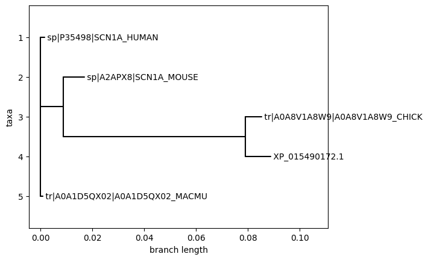

# Comparative Genomics Pipeline

A Python pipeline for analyzing evolutionary conservation of epilepsy-associated ion channel genes across vertebrate species.

**Current Status:** Work in progress. Core functionality implemented, testing and validation ongoing.

**Pipeline:** Ortholog retrieval → Multiple sequence alignment → Phylogenetic analysis → Conservation scoring → Human variant mapping

**Primary Gene:** SCN1A (voltage-gated sodium channel)
**Species:** Human, mouse, macaque, chicken, great tit

## Implementation

**Data Sources:**
- UniProtKB: Protein sequences, variant annotations
- NCBI Entrez: Orthologous sequences
- EBI Clustal Omega: MSA and phylogenetic trees
- RCSB PDB: Protein structures

**Technologies:**
- Python 3.9+ with asyncio for concurrent API calls
- Biopython for sequence analysis
- Docker for containerization
- NumPy/matplotlib for data processing and visualization


## Current Functionality

**Working:**
- Multi-database API integration (UniProt, NCBI, EBI)
- Asynchronous data retrieval and processing
- Multiple sequence alignment via Clustal Omega
- Phylogenetic tree construction
- Shannon entropy conservation scoring
- Human variant mapping (847 SCN1A variants processed)
- Docker containerization

**Limitations:**
- Proof-of-concept scale (4 species, 1 gene)
- Limited error handling and input validation
- Hardcoded configuration
- No automated testing suite
- Minimal documentation

## 🛠️ Installation & Usage

**Requirements:** Python 3.9+, Docker (optional)

```bash
# Local installation
git clone https://github.com/wperlichek/comparative-genomics-pipeline
cd comparative-genomics-pipeline
pip install -e .
comparative-genomics-pipeline

# Docker (recommended for reproducibility)
docker build -t genomics-pipeline .
docker run --rm -v $(pwd)/data:/app/data genomics-pipeline

# Clear previous results
rm -rf ./data/output/*
```

📁 **Full requirements:** [docs/requirements.md](docs/requirements.md)

## Results

**SCN1A Analysis (H. sapiens, M. musculus, M. mulatta, G. gallus, P. major):**
- Sequence identity ranges from 78-99% across vertebrates
- Phylogenetic relationships consistent with expected evolutionary divergence
- 847 human variants successfully mapped to conservation scores
- Disease variants show clustering in functionally critical transmembrane domains
- Addition of P. major (78% identity) provides improved resolution for conservation analysis

**Technical Validation:**
- Successful integration of multiple genomic databases
- Reproducible Docker workflow
- Conservation scoring correlates with known functional domains

## Installation

```bash
git clone [repository]
cd comparative-genomics-pipeline
pip install -e .
comparative-genomics-pipeline
```

**Docker:**
```bash
docker build -t genomics-pipeline .
docker run --rm -v $(pwd)/data:/app/data genomics-pipeline
```

## Development Roadmap

**Immediate Priorities:**
- Comprehensive testing suite (pytest)
- Robust error handling and API retry logic
- Configuration management (YAML-based)
- Command-line interface with proper argument parsing

**Planned Extensions:**
- Additional epilepsy genes (SCN2A, KCNQ2, GABRG2)
- Protein domain annotation integration
- Statistical significance testing for conservation scores
- Clinical variant database integration (ClinVar, OMIM)

## Sample Outputs

| Conservation Plot | Phylogenetic Tree | Variant Overlay |
|:----------------:|:----------------:|:---------------:|
|  |  |  |

---

*Self-directed computational biology project. Ongoing development and validation.*
