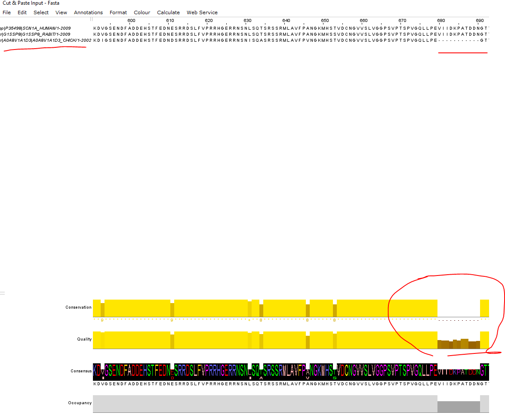

Here’s a clean, polished markdown version of your answers with some light formatting and smoothing for clarity and flow:

---

# MSA Analysis Worksheet

**Note:** These are *preliminary* results intended to build confidence in the pipeline and are not final conclusions.

---

### Basic Info

1. **What gene(s) am I analyzing?**
   SCN1A

2. **Which species are included in this alignment?**
   *Homo sapiens*, *Oryctolagus cuniculus*, and *Gallus gallus*

3. **What tool(s) did I use to create the alignment?**
   Clustal Omega via the European Bioinformatics Institute (REST API)

---

### Ortholog Data

4. **Do I have UniProt or Entrez Protein IDs for all sequences?**
   Yes

5. **Are there any missing IDs or sequences that I need to find or update?**
   No

---

### Alignment Quality

6. **Which parts of the alignment look highly conserved (similar or identical across species)?**
   Highly conserved regions visually identified at the following position ranges:

   * 81–208

     *Observation:* This sequence would stretch to 278 if we ignored pos 209 being different only for *Gallus Gallus*.

   * 352–449
   * 1252–1383

7. **Are there regions with many gaps or insertions? Where exactly (positions)?**
   Regions with many gaps or insertions:

   * 680–690

     *Observation:* Small region, may require inspection later. Used Occupancy plot to determine this. 

   * 2011–end

     *Observation:* Protein termini often show variability; gaps here are expected as functional domains tend to be conserved internally, while terminal regions can vary due to synthesis completion and species differences.

8. **Do any sequences show suspicious large insertions or deletions compared to others?**
   * 680-690
   
     *Observation:* This looks like a deletion event. *Homo sapiens* and *Oryctolagus cuniculus* have this but it's missing for *Gallus gallus*. Used Conservation plot to determine this. Worth noting that Quality plot is also very low here.

---

### Biological Insight

9. **Are the highly conserved regions associated with known functional domains or motifs?**
    * From: https://www.uniprot.org/uniprotkb/P35498/entry

    * 81–208
    *Observations:* Within topological domain. Within transmembrane. 
    More study is needed but it appears this region could be important 
    for core functionalities of the protein.

    * 352–449
    *Observations:* Extracellular. Pore-forming. Helical. Transmembrane.
    
    Inconclusive..

    * 1252–1383
    *Observations:* Transmembrane. Topological domain. Transmembrane... etc.. etc.. 

    Inconclusive...

10. **Could any gaps or insertions correspond to exon/intron boundaries or species-specific features?**
    Yes - Specifically 680-690 looks like it could be an exon on chicken
    . 
    _This requires more analysis
    into specific, annotated exon boundaries._

---

### Alignment Reliability

11. **Are there regions that look poorly aligned or contain many mismatches?**
    *~680-690
    *~1388-1415
    *~1955-end

12. **Should I consider trimming these regions before further analysis?**
    The sequences are only 2000BP long for this proteins... At this
    early stage it's probably not worth the extra work. The regions 
    are _relatively_ small and unlikely to compromise downstream results,
    like the tree generation should be OK and represenative for now. 
    We can tighten this up in further iterations.

---

### Next Steps for Analysis

13. **What tool or method should I use for trimming (if needed)?**
    TBD

14. **Which phylogenetic tree-building tool do I want to try first?**
    I used EBI's phyl tree generation Web API to create .nwk trees

15. **Do I need to re-run the alignment with different parameters or additional sequences?**
    TBD

---

### Reflection & Notes

16. **What surprised me or stood out when viewing the alignment?**
    My conserved sequences didn't line up perfectly with known features.
    I understand in nature this is often not the case, but I expected
    to have more obvious features connected to my observations from my
    MSA...

17. **What questions or uncertainties do I have about this alignment?**
    I am skeptical what insights I can gain from the alignment so far and need more domain knowledge.

18. **What files or screenshots do I want to save for reference?**
    I saved SCNA1.png, the jalview of the MSA.