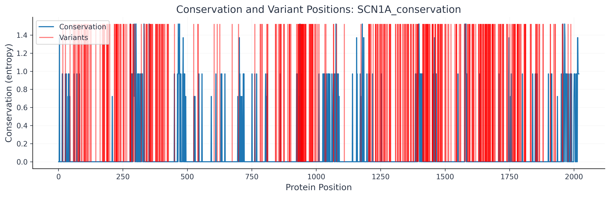

# Conservation and Variant Mapping Worksheet: SCN1A (Beginner Friendly)

---

## 1. What am I looking at?
- **What does this plot show?**
  This graph overlays two different results: sequence conservation and variants.
  
  Conservation is shown in blue and represents how conserved a sequence is among three species—human, rabbit, and chicken. A lower blue line means lower entropy, which indicates the region is highly conserved.

  The variants are shown in red—these are based only on the human sequence.

  The idea here is that any variants that overlap with highly conserved regions are possibly harmful mutations.

  _Important:_ The results of this plot still confuse me: Why are the default values of the variant calculation 1.6 in the plot? That doesn't seem to make sense for variant info to have a default entropy value of 1.6. Maybe the data defaults to the max for the variant if it exists, to make it more visible.

- **What is the protein or gene being studied?**
  SCN1A

---

## 2. Conservation (How similar are the sequences?)
- **Where do you see high points or low points in the plot?**
  There are both high and low points in the plot, showing regions of high and low conservation.

- **What might a high point mean? What about a low point?**
  A high point means high entropy, which is less conserved across species (human, rabbit, and chicken). A low point means low entropy, which is highly conserved.

---

## 3. Variants (Changes in the sequence)
- **Where are the dots or markers for variants?**
  The variants definitely seem to cluster. We have some regions with very few variants and others that are very red.

- **Do any variants fall in the high (conserved) regions?**
  Yes, for example around position ~1650.

- **Do any variants fall in the low (variable) regions?**
  At ~300 we see overlapping variants on high entropy (variable) regions. This suggests that variants can occur more easily here.

---

## 4. What could this mean?
- **Why might it matter if a variant is in a conserved region?**
  A conserved region is important because it is possibly part of the key functionality of the protein. If a variant occurs there, it could impact the protein's function. These conserved sequences show little variation among species because they are finely tuned by evolution to work efficiently. Any variant in such an efficient region could be bad news.

- **What questions do you have about this plot?**
  Why don't more variants occur at the end where there is so little conservation? Wouldn't that be the most natural place for variants to occur?

---

## 5. Next Steps & Notes
- **What would you like to learn next about this data?**
  I want to see which variants are the most harmful and where they land on this graph.

- **Anything that surprised you?**
  The overlapping red and blue on the plot was not the most intuitive at first, but with some time I suppose it makes sense for a quick look at the data. I think it would need to be iterated on for clarity.

---

## 6. Expanded Group Analysis
- Are any variants now in regions conserved across all groups?
- Did any regions change from variable to conserved (or vice versa) with more species?
- Any new patterns or surprises with the expanded set?

---

**Reference Figure:**

